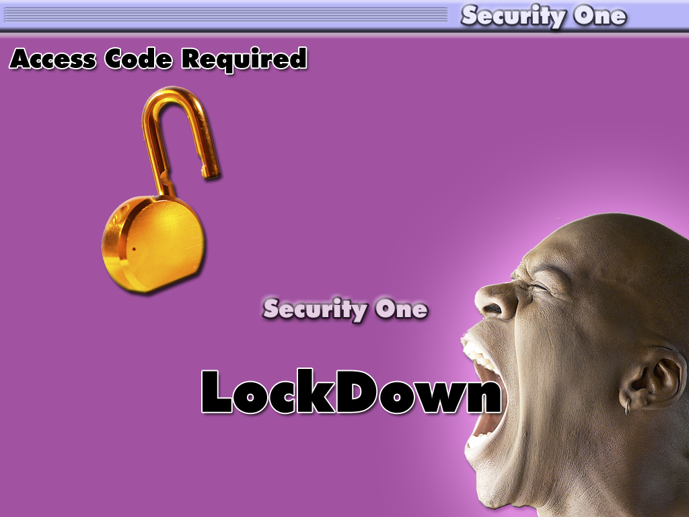



## SecureIT\-One

### Description

Security Lockdown App. Blocks ALT+TAB, CTRL+ALT+DEL, ALT+F4 etc. tested on XP PRO only.

Change password in code before compiling. Add to startup menu if required. Code a simple timer prog to SHELL the app at given intervals.
 
### More Info
 

             |
---                |---
**Submitted On**   |2005-12-24 22:10:04
**By**             |[Ian Platt](https://github.com/Planet-Source-Code/PSCIndex/blob/master/ByAuthor/ian-platt.md)
**Level**          |Intermediate
**User Rating**    |5.0 (10 globes from 2 users)
**Compatibility**  |VB 6\.0
**Category**       |[Complete Applications](https://github.com/Planet-Source-Code/PSCIndex/blob/master/ByCategory/complete-applications__1-27.md)
**World**          |[Visual Basic](https://github.com/Planet-Source-Code/PSCIndex/blob/master/ByWorld/visual-basic.md)
**Archive File**   |[SecureIT\-O19596712242005\.zip](https://github.com/Planet-Source-Code/ian-platt-secureit-one__1-63790/archive/master.zip)

